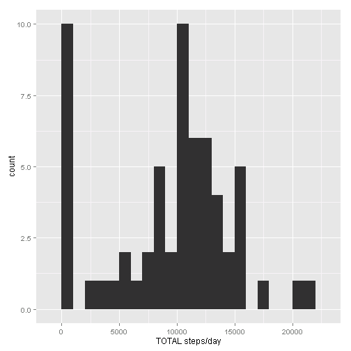
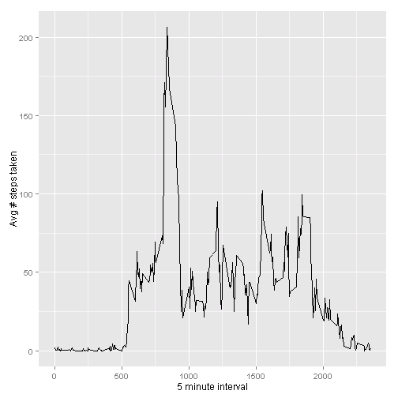
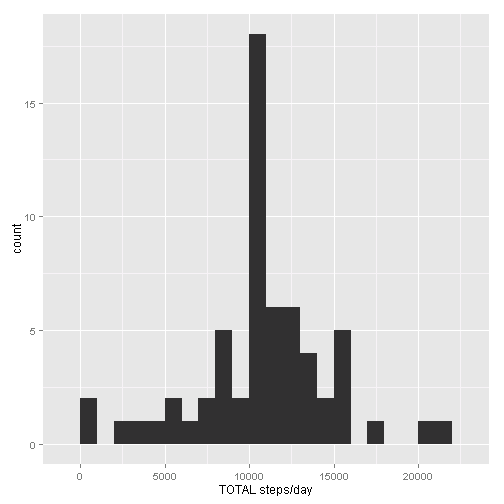
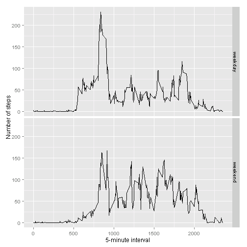

# Reproducible Research - Peer Assessment 1
## By: 1bird2bushes

## Loading and preprocessing the data

```r
data <- read.csv("activity.csv")
```

## What is mean total number of steps taken per day?

```r
library(ggplot2)
total.steps <- tapply(data$steps, data$date, FUN=sum, na.rm=TRUE)
qplot(total.steps, binwidth=1000, xlab="TOTAL steps/day")
```

 

```r
mean(total.steps, na.rm=TRUE)
```

```
## [1] 9354.23
```

```r
median(total.steps, na.rm=TRUE)
```

```
## [1] 10395
```

## What is the average daily activity pattern?

```r
library(ggplot2)
avgs <- aggregate(x=list(steps=data$steps), by=list(interval=data$interval),
                      FUN=mean, na.rm=TRUE)
ggplot(data=avgs, aes(x=interval, y=steps)) +
    geom_line() +
    xlab("5 minute interval") +
    ylab("Avg # steps taken")
```

 

Which 5-minute interval, on average across all the days in the dataset, 
contains the maximum number of steps?

```r
averages[which.max(avgs$steps),]
```

```
##     interval     day    steps
## 104      835 weekday 230.3782
```

## Imputing missing values

Note that there are a number of days/intervals where there are missing values (coded as NA). The presence of missing days may introduce bias into some calculations or summaries of the data.


```r
missing <- is.na(data$steps)
# How many missing
table(missing)
```

```
## missing
## FALSE  TRUE 
## 15264  2304
```

All missing values are filled in with mean value for the corresponding 5-minute interval.


```r
# Replace each missing value with mean value of its corresponding 5-minute interval.
fill.value <- function(steps, interval) {
    filled <- NA
    if (!is.na(steps))
        filled <- c(steps)
    else
        filled <- (avgs[avgs$interval==interval, "steps"])
    return(filled)
}
filled.data <- data
filled.data$steps <- mapply(fill.value, filled.data$steps, filled.data$interval)
```
Make a histogram of the total steps/day using the new 'data'  and calculate mean and median total number of steps.


```r
total.steps <- tapply(filled.data$steps, filled.data$date, FUN=sum)
qplot(total.steps, binwidth=1000, xlab="TOTAL steps/day")
```

 

```r
mean(total.steps)
```

```
## [1] 10766.19
```

```r
median(total.steps)
```

```
## [1] 10766.19
```
Naturally, the mean and median are going to be higher once NA values have been
filled. The reasoning behind this is that the mean is drawn from a pool of equal
size but has a larger sum. The default value assigned to the missing data would
therefore be 0, and thus replacing the 0's with nonzero's will obviously change
the histogram.

## Are there differences in activity patterns between weekdays and weekends?
Separate weekdays from weekends

```r
weekday.or.weekend <- function(date) {
    day <- weekdays(date)
    if (day %in% c("Monday", "Tuesday", "Wednesday", "Thursday", "Friday"))
        return("weekday")
    else if (day %in% c("Saturday", "Sunday"))
        return("weekend")
    else
        stop("invalid date")
}
filled.data$date <- as.Date(filled.data$date)
filled.data$day <- sapply(filled.data$date, FUN=weekday.or.weekend)
```
Make a panel plot containing a time series plot (i.e. type = "l") of the 5-minute 
interval (x-axis) and the average number of steps taken, averaged across all weekday 
days or weekend days (y-axis)

```r
avgs <- aggregate(steps ~ interval + day, data=filled.data, mean)
ggplot(avgs, aes(interval, steps)) + geom_line() + facet_grid(day ~ .) +
    xlab("5-minute interval") + ylab("Number of steps")
```

 
